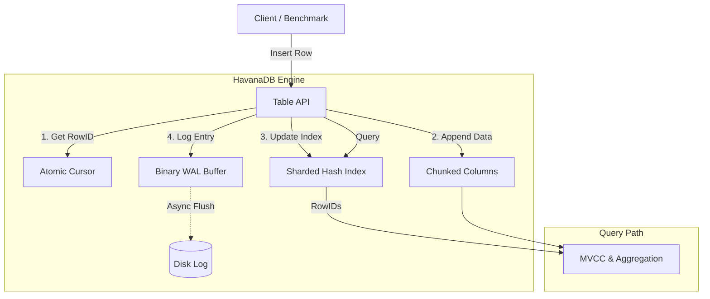

# HavanaDB

**An experimental, high-performance, in-memory columnar database engine written in C++17.**


HavanaDB is a prototype database engine designed to explore modern database architecture concepts found in systems like SAP HANA and Silo. It features a lock-free insert-only architecture, chunked memory management, and a hybrid aggregation model suitable for high-concurrency OLAP/OLTP mixed workloads.

## 🚀 Key Features

* **Column-Oriented Storage:** Optimized for analytical queries and cache locality.
* **Lock-Free Writes:** Uses `std::atomic` cursors for wait-free memory reservation.
* **Insert-Only Architecture:** Never modifies existing data in place. Updates are appended as new versions.
* **Chunked Memory Management:** Dynamic memory allocation without the cost of resizing giant vectors.
* **Hybrid Aggregation:**
    * `AGG_LAST`: Standard MVCC behavior (Last Write Wins).
    * `AGG_SUM`: Delta aggregation for high-performance counters (e.g., Inventory).
* **Partitioned Hash Index:** Low-contention indexing for O(1) point lookups.
* **Binary WAL (Write-Ahead Log):** Asynchronous Group Commit for durability and crash recovery.

##  Architecture



## Performance Benchmark
Running on Apple M1 Pro (Single Node):

Scenario	Rows	Threads	TPS (Transactions/sec)	Read Latency
Pure Memory (No Log)	5M	4	~840,000	< 0.1 ms
Durability (Binary WAL)	5M	4	~305,000	< 0.1 ms
Note: Performance bottleneck in Durability mode is currently the mutex contention on the single log buffer.

## Build & Run
### Prerequisites

* CMake 3.10+

* C++17 Compiler (GCC, Clang, or MSVC)

### Build

```Bash
mkdir build && cd build
cmake ..
make
``` 
### Run Benchmark

The benchmark performs logic verification, throughput testing, and a crash recovery simulation.

```Bash
./comp_benchmark
```

### Run SQL Shell (Experimental)

```Bash
./havana_sql
```

## Code Structure
* include/Table.h: The core engine orchestrating storage, indexing, and logging.

* include/Column.h: Chunked columnar storage implementation.

* include/HashIndex.h: Thread-safe partitioned hash index.

* include/BinaryLogger.h: Async logging with binary encoding and double buffering.

* include/MvccMeta.h: Visibility management (transaction timestamps).

## Roadmap
[ ] SQL Parser: Support for WHERE clauses and joins.

[ ] Delta Merge: Background process to merge delta logs into a read-optimized main store.

[ ] Optimistic Concurrency Control (OCC): Implement Serializable isolation level (Silo protocol).

[ ] Thread-Local Logging: Remove the global log mutex to restore 1M+ TPS.

## License
MIT License.